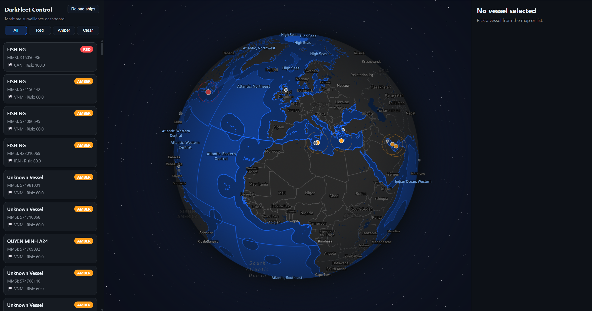
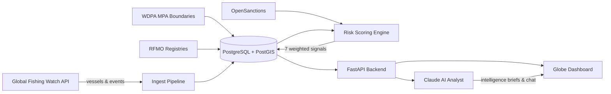
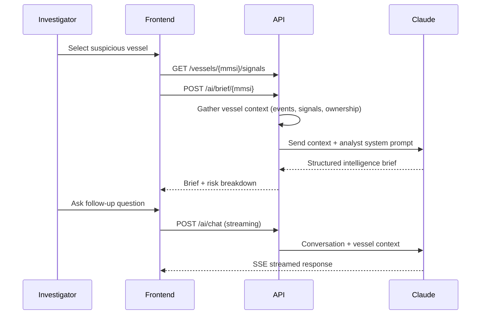
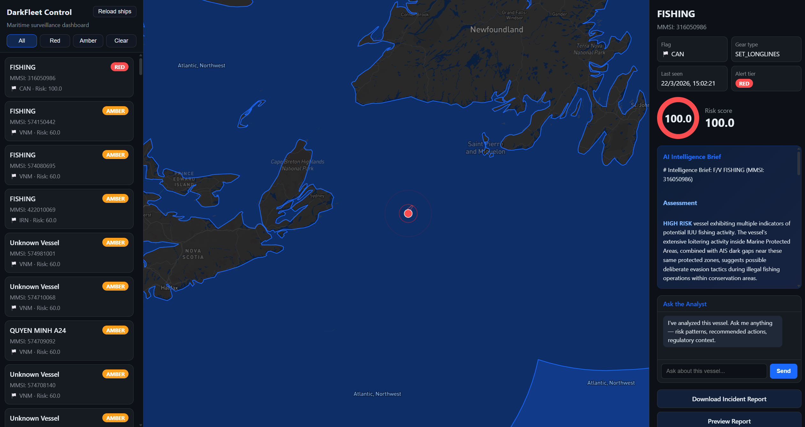
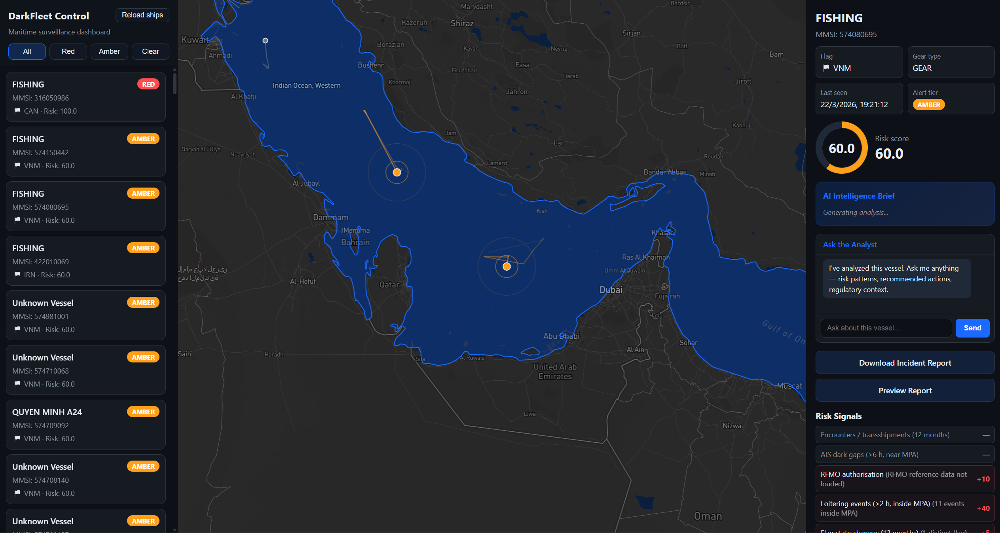
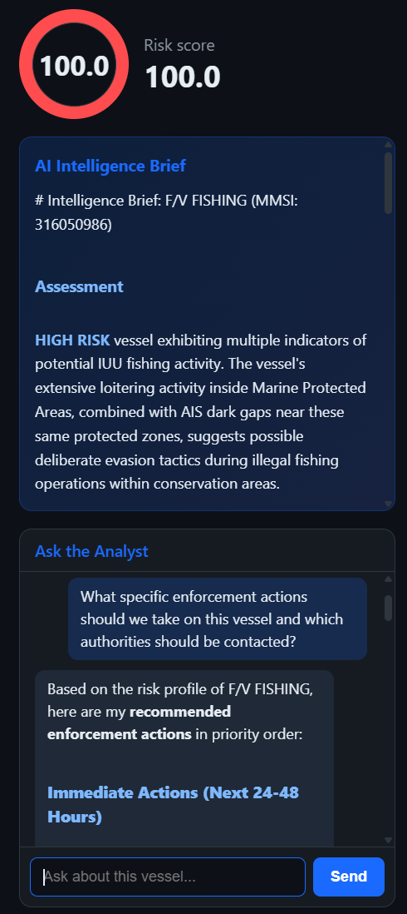
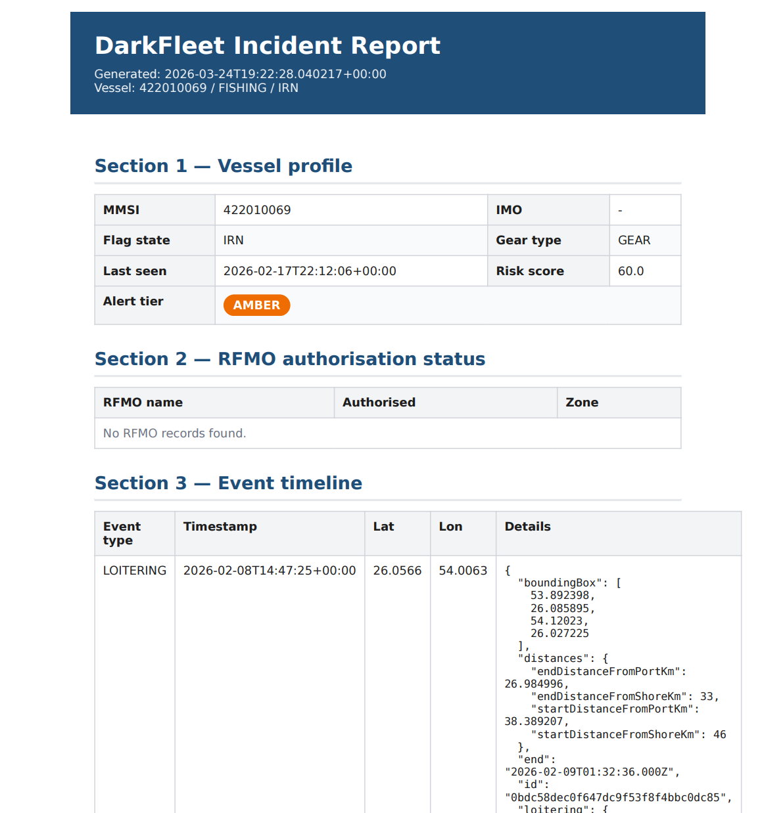

# DarkFleet

**AI-powered maritime surveillance that catches illegal fishing vessels before they disappear.**

IUU (Illegal, Unreported, and Unregulated) fishing is a **$23 billion** criminal enterprise destroying ocean ecosystems. Evidence exists across disconnected databases — satellite AIS tracking, marine protected area boundaries, RFMO registries, vessel ownership records, sanctions lists — but no single agency monitors them all.

DarkFleet consolidates **7 data sources** into a unified risk-scoring dashboard, ranks vessels by suspicion level, and uses **Claude AI** to generate real-time intelligence briefs for investigators.

> Built at the **Claude Hackathon @ Imperial College London**



---

## How It Works



### Risk Scoring

Every vessel gets a **0–100 risk score** computed from 7 signals over a rolling 12-month window:

| Signal | Max Points | What It Detects |
|--------|:----------:|-----------------|
| Encounters / transshipments | 80 | Illegal at-sea transfers |
| AIS dark gaps (>6h) | 70 | Transponder shutoffs to hide activity |
| RFMO absence | 20 | Fishing without authorization |
| Loitering events (>2h) | 40 | Prolonged stops in sensitive areas |
| Flag state changes | 10 | Flag-hopping to evade enforcement |
| Ownership opacity | 5 | Flags of Convenience / unverified registry |
| Sanctions match | 5 | Vessel or flag on sanctions lists |

**Alert tiers:** 🔴 Red ≥ 80 · 🟠 Amber ≥ 60 · ⚪ Clear < 60

Hard triggers override the score upward: IUU-blacklisted vessels are forced to Red, recently detained vessels to Amber.

### AI Intelligence Layer

Claude acts as a **maritime intelligence analyst**, receiving full vessel context — risk signals, event history, ownership data, flag history — and producing:

- **Intelligence briefs**: Structured assessment with key risk factors, pattern analysis, and recommended actions
- **Interactive chat**: Investigators can ask follow-up questions with streaming responses via SSE
- **Contextual awareness**: Claude understands RFMO regulations, flag state implications, and IUU behavioral patterns



---

## Screenshots

### Red Alert — AI Intelligence Brief
Select a high-risk vessel to get a Claude-generated intelligence assessment with key risk factors and recommended actions.



### Amber Alert — Risk Signals Breakdown
Drill into individual risk signals: loitering events, RFMO status, flag changes, and more.



### AI Intelligence Brief + Chat
Claude generates a structured risk assessment and answers follow-up questions about enforcement actions, jurisdiction, and next steps.



### PDF Incident Report
Generate downloadable incident reports with vessel profile, RFMO status, event timeline, and score breakdown.



---

## Tech Stack

| Layer | Technology |
|-------|-----------|
| **Backend** | Python, FastAPI, SQLAlchemy (async), Uvicorn |
| **Database** | PostgreSQL 16 + PostGIS 3.4 |
| **AI** | Claude API (Sonnet) via Anthropic SDK |
| **Frontend** | Vanilla JS, Mapbox GL JS (globe projection) |
| **Reports** | WeasyPrint (PDF generation), Jinja2 |
| **Data Sources** | Global Fishing Watch API, WDPA, RFMO registries, OpenSanctions |
| **Infrastructure** | Docker, Docker Compose |

---

## Quick Start

### Prerequisites
- Docker & Docker Compose
- API keys: [Global Fishing Watch](https://globalfishingwatch.org/), [Mapbox](https://mapbox.com/), [Anthropic](https://anthropic.com/)

### Setup

```bash
# Clone and configure
git clone https://github.com/your-org/darkfleet.git
cd darkfleet
cp .env.example .env
# Edit .env with your API keys: GFW_API_KEY, MAPBOX_TOKEN, ANTHROPIC_API_KEY

# Launch
docker-compose up

# Open http://localhost:8000
```

Click **"Reload Ships"** in the dashboard to ingest vessels from Global Fishing Watch. The scoring engine runs automatically after ingest.

### Optional: Load additional data sources

```bash
# Marine Protected Area boundaries (WDPA GeoJSON)
python scripts/wdpa_ingest.py path/to/wdpa.geojson

# RFMO authorisation lists
python scripts/rfmo_ingest.py --wcpfc wcpfc.csv --iccat iccat.csv

# Vessel ownership enrichment (GISIS)
curl -X POST http://localhost:8000/enrich/all
```

---

## API Endpoints

| Method | Endpoint | Description |
|--------|----------|-------------|
| `GET` | `/alerts` | All vessels ranked by risk score |
| `POST` | `/ingest` | Trigger GFW data import + auto-scoring |
| `POST` | `/ai/brief/{mmsi}` | Generate Claude intelligence brief |
| `POST` | `/ai/chat` | Streaming AI conversation about a vessel |
| `POST` | `/score/all` | Rescore all vessels |
| `GET` | `/report/{mmsi}` | Download PDF incident report |
| `GET` | `/vessels/{mmsi}/signals` | Risk signal breakdown |
| `GET` | `/vessel-trails` | GeoJSON vessel movement paths |
| `GET` | `/mpa` | MPA zone boundaries |

---

## Project Structure

```
darkfleet/
├── app/
│   ├── main.py              # FastAPI app, CORS, router registration
│   ├── models.py            # Vessel, Event, MPAZone, RFMOAuthorised, VesselOwnership
│   ├── scoring.py           # 7-signal risk scoring engine
│   ├── database.py          # Async SQLAlchemy + PostGIS setup
│   └── routers/
│       ├── ai.py            # Claude intelligence briefs & streaming chat
│       ├── scoring.py       # /alerts, /score endpoints
│       ├── vessels.py       # Vessel queries & trails
│       ├── reports.py       # PDF/HTML incident reports
│       ├── ingest.py        # GFW data import trigger
│       ├── mpa.py           # MPA zone GeoJSON
│       └── enrich.py        # GISIS ownership enrichment
├── frontend/
│   └── index.html           # Single-page dashboard (Mapbox + AI chat)
├── scripts/
│   ├── gfw_ingest.py        # Global Fishing Watch vessel & event ingestion
│   ├── wdpa_ingest.py       # MPA boundary loader
│   ├── rfmo_ingest.py       # RFMO registry loader
│   └── imo_gisis_enrich.py  # IMO/GISIS ownership lookup
├── docker-compose.yml
├── Dockerfile
└── requirements.txt
```

---

## Challenges

- **Fragmented data**: Most maritime databases lack public APIs. GISIS requires scraping, IUU lists come as PDFs/Excel, RFMO formats vary by organization.
- **Spatial query performance**: Optimizing PostGIS spatial joins (ST_DWithin, ST_Within) to avoid N+1 explosions across hundreds of vessels and thousands of events.
- **Real-time AI context**: Building rich vessel context documents for Claude that include scoring signals, event timelines, and ownership chains — all assembled on-the-fly from multiple database queries.

---

## Team

Built with Claude at Imperial College London.

## License

MIT
